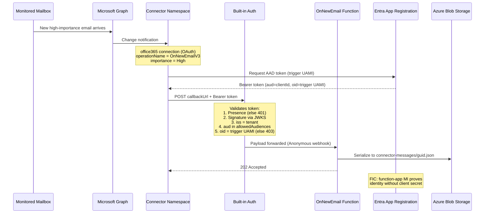

# Azure Functions + Microsoft 365 Email secured with Managed Identity + built-in authentication

> **Receive a new-email event from Microsoft 365 in an Azure Function — where the only thing allowed to invoke that function is the Connector Namespace's own managed identity (no shared keys, no client secrets, anywhere).**

> [!CAUTION]
> **Personal and sensitive data.** This sample serializes the full email trigger payload (sender, subject, body) to Azure Blob Storage — **for demonstration purposes only**. Do not run this sample against a mailbox containing sensitive, confidential, or personal data unless you have ensured that:
>
> - The **Function App, Storage Account** and **Application Insights** resource are accessible only to the mailbox owner (or an appropriately authorized set of users).
> - Your organization's data-handling and privacy policies permit storing email content in the configured Storage account.
> - You tear down the sample (`azd down --purge`) promptly after testing to avoid retaining personal data.
> - You **scope the trigger** to limit which emails fire the function. By default this sample only triggers on high-importance emails in the Inbox. Before deploying, review and adjust the trigger parameters in `infra/scripts/postdeploy.ps1` (or `.sh`) to match your scenario — for example, filter by `folderPath` to a specific subfolder, or change `importance` to reduce the volume of emails processed.

> **More triggers and operations:** See the full [Operations to Azure Functions Signature Mapping](https://github.com/Azure/azure-functions-connector-extension/blob/main/docs/operations-functions-match.md) for all supported connector triggers and their .NET, Python, and TypeScript signatures.

## Trigger configuration

The post-deploy script creates a trigger config on the Connector Namespace with the following settings:

| Setting | Value | Description |
| ------- | ----- | ----------- |
| `operationName` | `OnNewEmailV3` | Fires when a new email arrives. |
| `folderPath` | `Inbox` | Monitors the Inbox folder. |
| `importance` | `High` | Only triggers on high-importance emails. |
| `authentication.type` | `ManagedServiceIdentity` | The connector mints an AAD token using the trigger UAMI. |

To change these defaults, edit the trigger parameters in `infra/scripts/postdeploy.ps1` (Windows) or `infra/scripts/postdeploy.sh` (Linux/macOS) before running `azd up`.

## Deploy and test

**Prereqs:** `azd`, `az` CLI, .NET 10 SDK, `jq` (for the bash post-deploy script in Mac and Linux).

```bash
azd auth login
az login

# Some tenants (Microsoft included) require every new Entra app registration to
# carry a Service Management Reference. If you hit
# "ServiceManagementReference field is required for Update" during provision,
# set this once on the azd env -- the value is your service tree GUID or any
# identifier your tenant policy accepts.
azd env set SERVICE_MANAGEMENT_REFERENCE <your-service-tree-guid>

azd up
```

The post-deploy hook creates the trigger config (with the `ManagedServiceIdentity` authentication block) on the Connector Namespace, installs the `connector-namespace` Azure CLI extension if needed, and opens a browser to OAuth-authorize the `office365` connection.

**Confirm built-in auth is the live gate** — hit the function with no token, expect a 401:

```bash
curl -i "https://<your-func>.azurewebsites.net/runtime/webhooks/connector?functionName=OnNewEmail"
# → HTTP/1.1 401 Unauthorized
# → WWW-Authenticate: Bearer realm="<your-func>.azurewebsites.net"
```

**Confirm the end-to-end happy path** — send yourself an email, then check Application Insights `traces` for the `OnNewEmail invoked` line (and the rest of the payload log). You should see logs similar to the following;

```
5/21/2026, 3:10:58 PM Information OnNewEmail invoked (caller pre-validated by built-in authentication).
5/21/2026, 3:10:58 PM Information Email received from: <sender's email address>
5/21/2026, 3:10:58 PM Information Email subject: <email subject>
```

---

## Clean up

> [!WARNING]
> **While this sample is deployed, `OnNewEmail` serializes the full email trigger payload (sender, subject, body) to Blob Storage.** This is intended for hands-on demonstration only. Tear the sample down when you are done to avoid retaining personal or sensitive email data:

```bash
azd down --purge
```

`--purge` also removes the soft-deleted Application Insights / Log Analytics workspace so old email metadata doesn't linger.

---

## How it works (end-to-end)



---

## Security model

Two managed identities, one Entra app, one federated trust — and **zero secrets**.

| Component | Purpose |
| --- | --- |
| **Function-app UAMI** | Storage + App Insights access, and the identity that built-in auth uses (via FIC) to mint client assertions instead of a client secret. |
| **Trigger UAMI** | Attached to the Connector Namespace. The connector runtime uses this identity to mint the AAD bearer token attached to every callback. |
| **Entra app registration** | The `aud` of the bearer token. Has a federated identity credential trusting the function-app UAMI (so built-in auth can authenticate the app *as* the Entra app without storing a secret). |
| **App Service built-in authentication** (`authsettingsV2`) | Edge-level token validator. Configured with `clientId` = Entra app, `allowedAudiences` = its clientId/identifierUri, `allowedPrincipals.identities` = `[trigger UAMI principalId]`. |
| **Connector Namespace** | Hosts the `office365` connection (OAuth to your mailbox) and the trigger config. |

### What's enforced — and where

Built-in authentication runs **inside the App Service worker, before** the Functions host sees the request. On every inbound call it validates, in order:

1. **Token presence** — missing/expired ⇒ **401** (`requireAuthentication: true` + `unauthenticatedClientAction: Return401`).
2. **Signature** — against the issuer's JWKS for your tenant.
3. **`iss`** — must match `openIdIssuer` (`https://login.microsoftonline.com/<tenant>/v2.0`).
4. **`aud`** — must be in `allowedAudiences`.
5. **`defaultAuthorizationPolicy.allowedPrincipals.identities`** — the token's `oid` must equal the trigger UAMI's `principalId`. **Any other identity gets a 403**, even with an otherwise-valid token for your `aud`.

This means **no application code is needed for the access check** — the function never sees a request that didn't come from the trigger UAMI.

### One enforcement layer, not two

`/runtime/webhooks/connector` is normally also protected by a Functions system key (`connector_extension`) — the `&code=...` query string. We opt out of that check in [`host.json`](host.json):

```json
{
  "version": "2.0",
  "telemetryMode": "OpenTelemetry",
  "extensions": {
    "connector": {
      "system": {
        "webhookAuthorizationLevel": "Anonymous"
      }
    }
  }
}
```

The shared-key check is strictly weaker than the AAD token check (a key is a static secret; a token is signed, audience-scoped, identity-scoped, and short-lived), so removing it deletes a thing-to-leak without lowering the security bar. **Built-in authentication is the only gate.**

### Re-running `azd up` / `azd provision`

The Connector Namespace RP **rejects `identity` in update PUTs after the resource is created**, even when the body is identical to live state:

```
ManagedIdentityInvalid: The request to update resource 'cns-…' managed identities
is not valid. The user assigned identities can not be changed.
```

To avoid this on the 2nd+ provision, set `CREATE_CONNECTOR_NAMESPACE` to `false`. The bicep then references the namespace as `existing` instead of re-PUTing it; the `office365` connection, access policies, and everything else continue to deploy normally:

```bash
azd env set CREATE_CONNECTOR_NAMESPACE false
azd up   # or: azd provision
```

If you only changed function code (not infra), skip provision entirely:

```bash
azd deploy
```
